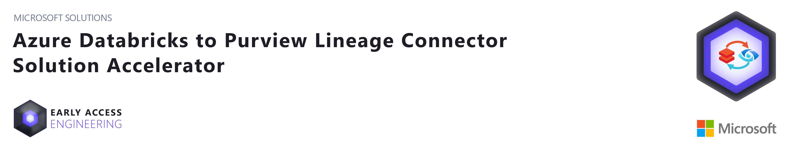
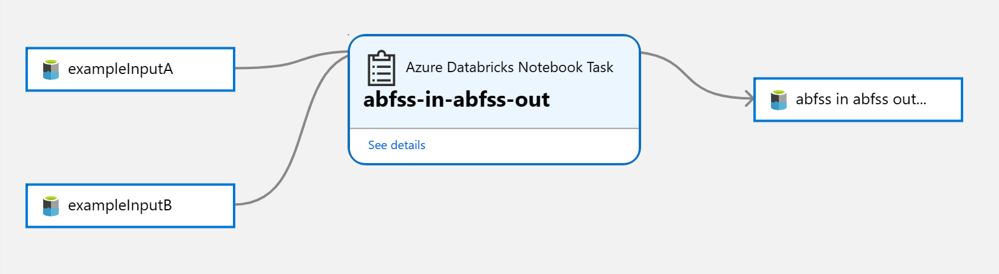
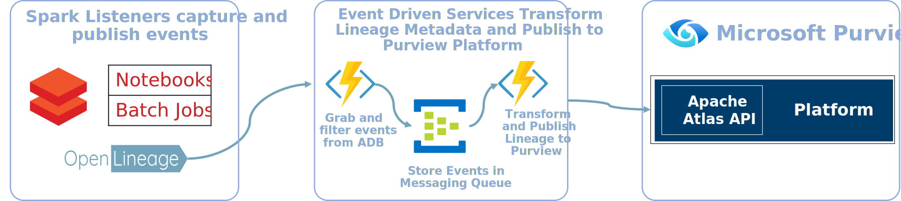
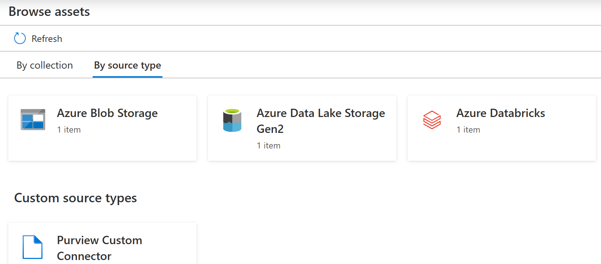
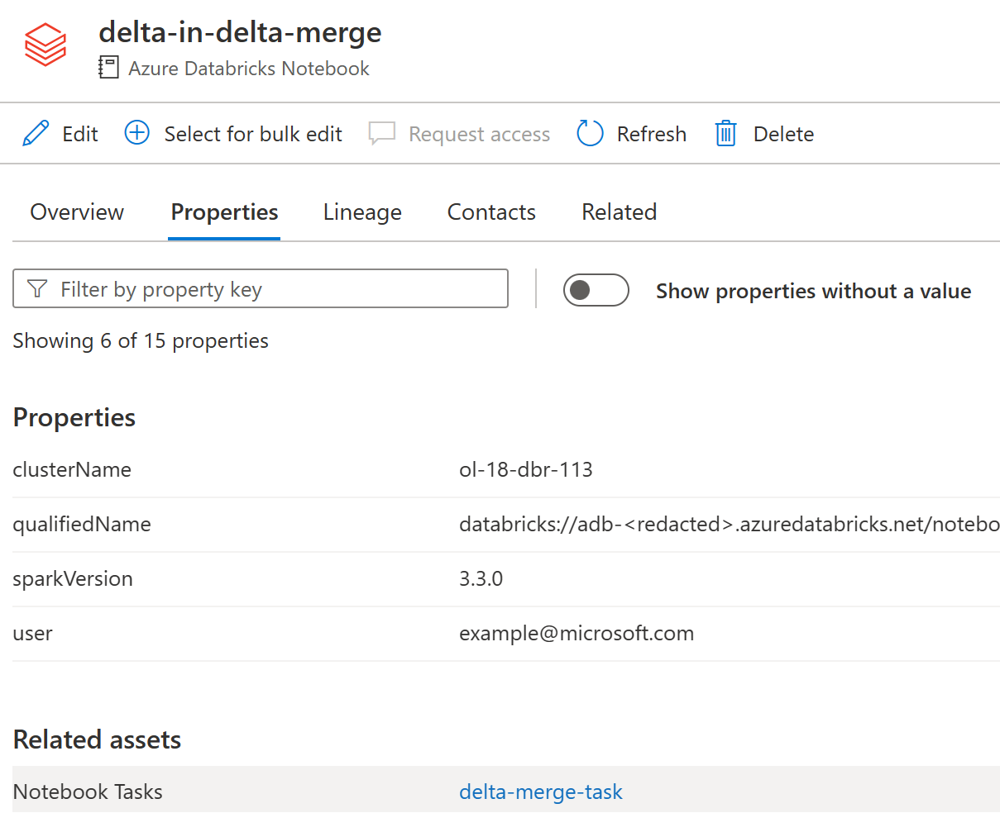
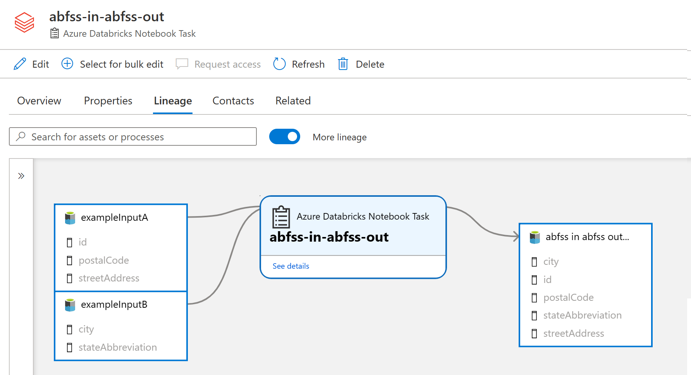

<!-- markdownlint-disable MD033 - HTML rule -->

Microsoft Solutions / Early Access Engineering

# Azure Databricks to Purview Lineage Connector

This solution accelerator, together with the [OpenLineage](http://openlineage.io) project, provides a connector that will transfer lineage metadata from Spark operations in Azure Databricks to Microsoft Purview, allowing you to see a table-level lineage graph as demonstrated above.

> **Note**
> In addition to this solution accelerator, Microsoft Purview is creating native models for Azure Databricks (e.g.: Notebooks, jobs, job tasks...) to integrate with Catalog experiences. With native models in Microsoft Purview for Azure Databricks, customers will get enriched experiences in lineage such as detailed transformations.
> If you choose to use this solution accelerator in a Microsoft Purview account before the native models are released, these enriched experiences are not backward compatible.
> Please reach out to your Microsoft account representative for timeline related questions on the upcoming model enrichment for Azure Databricks in Microsoft Purview.**

## Contents

* [Overview](#overview)
* [Features](#features)
* [Videos](#videos)
* [Prerequisites](#prerequisites)
* [Getting Started](#getting-started)
* [Using the Connector](#using-the-connector)
* [Troubleshooting](#Troubleshooting)
* [Limitations & more](#Limitations)

## Overview

Gathering lineage data is performed in the following steps:

1. Azure Databricks clusters are configured to initialize the OpenLineage Spark Listener with an endpoint to receive data.
1. Spark operations will output data in a standard OpenLineage format to the endpoint configured in the cluster.
1. Endpoint provided by an Azure Function app that will filter incoming data and pass it to an Azure EventHub.
1. Events are captured by a second Function app to transform the data into a format compatible with Atlas and Purview.
1. Lineage data is synchronized with existing Purview metadata and uploaded to Purview using standard Apache Atlas APIs.

## Features

* Supports table level lineage from Spark Notebooks and jobs for the following data sources:
  * Azure SQL
  * Azure Synapse Analytics (as input)
  * Azure Data Lake Gen 2
  * Azure Blob Storage
  * Delta Lake (Merge command not supported)
  * Azure Data Explorer
  * Azure Data Factory orchestration
  * Hive Tables (in default metastore)
  * MySQL
  * PostgreSQL
* Supports Spark 3.0, 3.1, 3.2, and 3.3 (Interactive and Job clusters) / Spark 2.x (Job clusters)
  * Databricks Runtimes between 9.1 and 11.3 LTS are currently supported
* Can be configured per cluster or for all clusters as a global configuration 
* Support **column level lineage** for ABFSS, WASBS, and default metastore hive tables (see [Limitations](./LIMITATIONS.md#column-level-mapping-supported-sources) for more detail)
* Once configured, **does not require any code changes to notebooks or jobs**
* Can [add new source support through configuration](./docs/extending-source-support.md)  

## Videos

* [Solution Overview](https://youtu.be/LrtDmLnRse0)
* [Deploying the Demo](https://youtu.be/pLF0iykhruY)
* [Troubleshooting](https://youtu.be/kG8Maa1kOx0)

## Prerequisites

Installing this connector requires the following:

1. Azure subscription-level role assignments for both `Contributor` and `User Access Administrator`.
1. Azure Service Principal with client ID and secret - [How to create Service Principal](https://docs.microsoft.com/en-us/azure/active-directory/develop/howto-create-service-principal-portal).

## Getting Started

There are two deployment options for this solution accelerator:

* ### [Demo Deployment](./deploy-demo.md)

    No additional prerequisites are necessary as the demo environment will be setup for you, including Azure Databricks, Purview, ADLS, and example data sources and notebooks.

* ### [Connector Only Deployment](./deploy-base.md)

    If installed as a working connector, Azure Databricks, data sources, and Microsoft Purview are assumed to be setup and running.

## Using the Connector

*Ensure both the Azure Function app and Azure Databricks cluster are running.*

1. Open your Databricks workspace to run a Spark job or notebook which results in data being transferred from one location to another. For the demo deployment, browse to the Workspace > Shared > abfss-in-abfss-out-olsample notebook, and click "Run all".

1. Once complete, open your Purview workspace and click the "Browse assets" button near the center of the page

1. Click on the "By source type" tab  
You should see at least one item listed under the heading of "Azure Databricks".  In addition there will possibly be a Purview Custom Connector section under the Custom source types heading

    

1. Click on the "Databricks" section, then click on the link to the Azure Databricks workspace which the sample notebook was ran. Then select the notebook which you ran (for those running Databricks Jobs, you can also select the job and drill into the related tasks) 
    * After running a Databricks Notebook on an Interactive Cluster, you will see lineage directly in the Notebook asset under the Lineage tab.
    * After running a Databricks Job on a Job Cluster, you will see lineage in the Notebook Task asset. To navigate from a Notebook to a Notebook Task select the Properties tab and choose the Notebook Tasks from the Related Assets section. Please note that Databricks Jobs lineage require [additional setup](./deploy-base.md#support-extracting-lineage-from-databricks-jobs) outside of the demo deployment.

    

1. Click to the lineage view to see the lineage graph

    

    **Note**: If you are viewing the Databricks Process shortly after it was created, sometimes the lineage tab takes some time to display. If you do not see the lineage tab, wait a few minutes and then refresh the browser.

    **Lineage Note**: The screenshot above shows lineage to an Azure Data Lake Gen 2 folder, you must have scanned your Data Lake prior to running a notebook for it to be able to match to a Microsoft Purview built-in type like folders or resource sets.

## Troubleshooting

**When filing a new issue, [please include associated log message(s) from Azure Functions](./TROUBLESHOOTING.md#debug-logs).** This will allow the core team to debug within our test environment to validate the issue and develop a solution.

If you have any issues, please start with the [Troubleshooting Doc](./TROUBLESHOOTING.md) and note the [limitations](./LIMITATIONS.md) which affect what sort of lineage can be collected. If the problem persists, please raise an [Issue on GitHub](https://github.com/microsoft/Purview-ADB-Lineage-Solution-Accelerator/issues).

## Limitations

The solution accelerator has some [limitations which affect what sort of lineage can be collected](./LIMITATIONS.md).

## Contributing

This project welcomes contributions and suggestions. Most contributions require you to agree to a Contributor License Agreement (CLA) declaring that you have the right to, and actually do, grant us the rights to use your contribution. For details, visit <https://cla.opensource.microsoft.com>.

When you submit a pull request, a CLA bot will automatically determine whether you need to provide a CLA and decorate the PR appropriately (e.g., status check, comment). Simply follow the instructions provided by the bot. You will only need to do this once across all repos using our CLA.

This project has adopted the Microsoft Open Source Code of Conduct. For more information see the Code of Conduct FAQ or contact opencode@microsoft.com with any additional questions or comments.

## Trademarks

This project may contain trademarks or logos for projects, products, or services. Authorized use of Microsoft trademarks or logos is subject to and must follow Microsoft's Trademark & Brand Guidelines. Use of Microsoft trademarks or logos in modified versions of this project must not cause confusion or imply Microsoft sponsorship. Any use of third-party trademarks or logos are subject to those third-party's policies

## Data Collection

The software may collect information about you and your use of the software and send it to Microsoft. Microsoft may use this information to provide services and improve our products and services. You may turn off the telemetry as described in the repository. There are also some features in the software that may enable you and Microsoft to collect data from users of your applications. If you use these features, you must comply with applicable law, including providing appropriate notices to users of your applications together with a copy of Microsoft’s privacy statement. Our privacy statement is located at <https://go.microsoft.com/fwlink/?LinkID=824704>. You can learn more about data collection and use in the help documentation and our privacy statement. Your use of the software operates as your consent to these practices.
