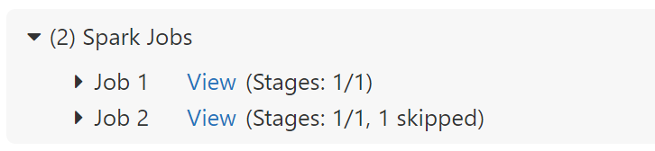

# Estimating Cost of the Azure Databricks to Purview Lineage Connector

The Excel spreadsheet in this directory provides a loose cost estimate that can be adjusted to your unique workload behaviors. Before running this solution, you should verify pricing is accurate based on your own organization's and primary region's official pricing sheets.

## Key Metrics Requiring Input

The below metrics require customization and research based on your workload's behavior and design.

* **Notebooks Executed per Hour**: For a given hour, how many notebooks / jobs do you expect to run?
* **Notebooks Running Concurrently**: For that hour, how many notebooks would be running at the same time?
* **Average Spark Job per Notebook**: On average, how many spark jobs occur per notebook?
  * This can be observed in the Spark Notebook user interface or aggregated in the Spark UI.  
  
* **Average Inputs per Notebook**: How many input sources are you connecting to on average?
* **Average Outputs per Notebook**: How many output sources are you connecting to on average?
* **Average Message Size Per Event (Bytes)**: How large are the messages from OpenLineage to Purview?
  * More complex Spark logical plans (e.g. large amounts of transformations) will result in larger messages.
  * You can estimate this by recording a sample of OpenLineage messages in the Databricks Driver Logs and calculating the number of bytes used.
