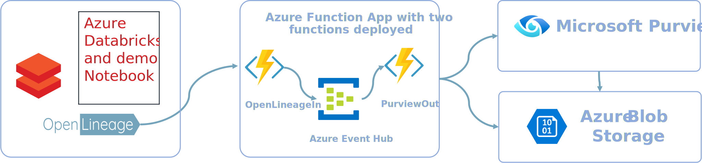
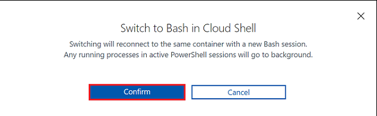
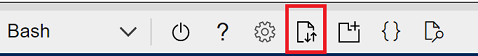
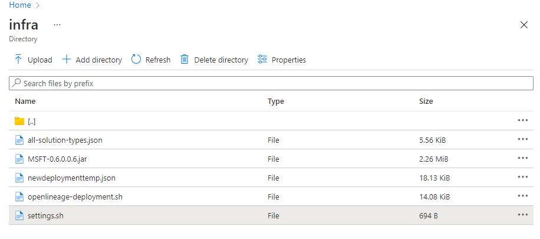

<!-- markdownlint-disable MD033 - HTML rule -->
# Deployment of the Purview ADB Lineage Solution Accelerator Demo

No additional prerequisites are necessary as the demo environment will be setup for you, including Azure Databricks, Purview, ADLS, and example data sources and notebooks.

## Services Installed
  


## Deployment Steps

### Choose your subscription and create resource group

From the [Azure Portal](https://portal.azure.com)

1. At the top of the page, click the Cloud Shell icon

    

1. Make sure “Bash” is selected from the dropdown menu located at the left corner of the terminal.

    

    a. Click “Confirm” if the “Switch to Bash in Cloud Shell” pop up appears.

    

1. Use `az account set --subscription "<SubscriptionID>"` to select the azure subscription you want to use.

    **Note**: If your Cloud Shell disconnects, you will need to rerun this command again to ensure the correct subscription.

1. Create a resource group for the demo deployment by using  
`az group create --location <ResourceGroupLocation> --resource-group <ResourceGroupName>`

    **Note**: Save the name of this resource group for use later

### Clone the repository into Azure cloud shell

1. Change directory to the cloud storage directory (clouddrive)  
    `cd clouddrive`

1. Clone this repository into the clouddrive directory

    ```bash
    git clone [-b <release_tag>] https://github.com/microsoft/Purview-ADB-Lineage-Solution-Accelerator.git
    ```

    > **Note**: We highly recommend cloning from [specific release tags listed here](https://github.com/microsoft/Purview-ADB-Lineage-Solution-Accelerator/tags).
    >
    > Clone the main branch only when using the edge version.

### Configure application settings file

1. After the clone, click the "Upload/download" icon and select “manage file share”


1. Navigate to `Purview-ADB-Lineage-Solution-Accelerator/deployment/infra/settings.sh` click “…” and select "edit"


1. Input values for:
    * Resource group
    * Prefix (this is added to service names)
    * Client ID & Secret (from the App ID required as a [prerequisite](https://github.com/microsoft/Purview-ADB-Lineage-Solution-Accelerator#prerequisites))
    * Tenant id
    * Purview location
    * Resource Tags (optional, in the following format: `{"Name":"Value","Name2":"Value2"}`)
      * NOTE: Resource Tags are optional. If you are not using any Resource Tags, input empty set of double quotes("").

1. Push the Save icon to save your changes

### Run the installation script

**Note**: Running this script will create all the services noted above, including Azure Databricks and an Azure Databricks cluster which will start after deployment.  This cluster is configured to auto terminate after 15 minutes but some Azure charges will accrue.

1. Navigate to `cd clouddrive/Purview-ADB-Lineage-Solution-Accelerator/deployment/infra`

1. Run `./openlineage-deployment.sh`

1. *(Manual Configuration)* After the initial deployment the script will stop and will ask you to add the service principal to the data curator role in the Purview resource.  Follow this documentation to [Set up Authentication using Service Principal](https://docs.microsoft.com/en-us/azure/purview/tutorial-using-rest-apis#set-up-authentication-using-service-principal) using the Application Identity you created as a prerequisite to installation.

1. Once your service principal is added, go back to the Bash terminal and hit "Enter"

1. The Purview types will be deployed and the deployment will finish

### Post Installation

Note: If your original bash shell gets closed or goes away while you are completing the manual installation steps above, you can manually run the final part of the installation by running the following from a cloud bash shell in the same subscription context:

```bash
purview_endpoint="https://<enter_purview_account_name>.purview.azure.com"
TENANT_ID="<TENANT_ID>" 
CLIENT_ID="<CLIENT_ID>" 
CLIENT_SECRET="<CLIENT_SECRET>"

acc_purview_token=$(curl https://login.microsoftonline.com/$TENANT_ID/oauth2/token --data "resource=https://purview.azure.net&client_id=$CLIENT_ID&client_secret=$CLIENT_SECRET&grant_type=client_credentials" -H Metadata:true -s | jq -r '.access_token')
purview_type_resp_custom_type=$(curl -s -X POST $purview_endpoint/catalog/api/atlas/v2/types/typedefs \
        -H "Authorization: Bearer $acc_purview_token" \
        -H "Content-Type: application/json" \
        -d @Custom_Types.json )

purview_type_resp_databricks_type=$(curl -s -X POST $purview_endpoint/catalog/api/atlas/v2/types/typedefs \
        -H "Authorization: Bearer $acc_purview_token" \
        -H "Content-Type: application/json" \
        -d @Databricks_Types.json )
echo $purview_type_resp_custom_type
echo $purview_type_resp_databricks_type
```
