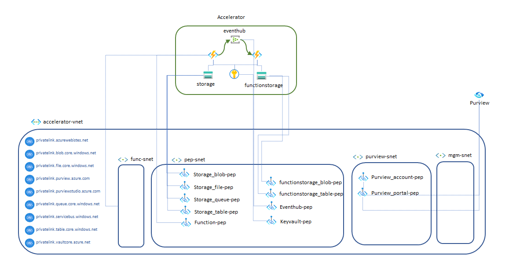

# Deploying the Solution with Private Endpoints

When deploying this solution to support an Azure Databricks instance inside of a VNET with no inbound / outbound access and / or a Microsoft Purview instance with private endpoints and no public internet access, the solution must be deployed with the following changes.

This solution accelerator does not solve for all scenarios but additional [samples for Azure Function networking](https://learn.microsoft.com/en-us/samples/azure-samples/function-app-arm-templates/arm-templates-for-function-app-deployment/) can be used to compliment the solution accelerator for more advanced networking scenarios.

You may need to modify the `deployment/infra/newdeploymenttemp.json` template for it to pass your Azure Policy validation checks if your company requires private endpoints / no public network access at deployment time.

## Steps to Deploy the Solution Accelerator Connector Only to Support Private Endpoints

1. The Azure Function should be deployed as an Elastic Premium instance instead of the Dynamic instance.
    * The `deployment/infra/newdeploymenttemp.json` takes a `functionSku` parameter which can have any of the values: `Dynamic, EP1, EP2, EP3` and will deploy an Azure Function with that SKU.
    * The Azure Function should then be [manually injected into the VNET](https://learn.microsoft.com/en-us/azure/azure-functions/functions-create-vnet#integrate-the-function-app) that has connectivity to Azure Databricks and Microsoft Purview.
1. The `functionstorage{uniqueid}` storage account requires two private endpoints
    * One private endpoint with a target sub-resource of `table`.
    * One private endpoint with a target sub-resource of `blob`.
1. The `storage{prefix}{uniqueid}` storage account requires one private endpoint with a target sub-resource of `blob`.
1. The Azure Event Hub namespace requires a private endpoint with a target sub-resource of `namespace`.

## Accelerator Network Schema

In order to make all your resources private, you can modify component already deployed or modify arm template in order to create private resources. 
In both cases Network schema sould resemble like this:

In Azure v-net for a better handling I created several subnet
- func-snet 
For Function  Vnet injection

- pep-snet
For all private endpoint

- purview-snet
Reserved for Purview Endpoint

- mgm-snet
For management prupose

When you create Private Endpoint some additional DNS zones are created/updated

*privatelink.azurewebsites.net*
*privatelink.blob.core.windows.net*
*privatelink.file.core.windows.net*
*privatelink.purview.azure.com*
*privatelink.purviewstudio.azure.com*
*privatelink.queue.core.windows.net*
*privatelink.servicebus.windows.net*
*privatelink.table.core.windows.net*
*privatelink.vaultcore.azure.net*

### Additional Tutorials

* Add [Private Endpoint to Storage Account](https://learn.microsoft.com/en-us/azure/storage/common/storage-private-endpoints)
* Add [Private Endpoint to Azure Event Hub Namespace](https://learn.microsoft.com/en-us/azure/event-hubs/private-link-service)
* Add [Private Endpoint to Azure Key Vault](https://learn.microsoft.com/en-us/azure/key-vault/general/private-link-service)