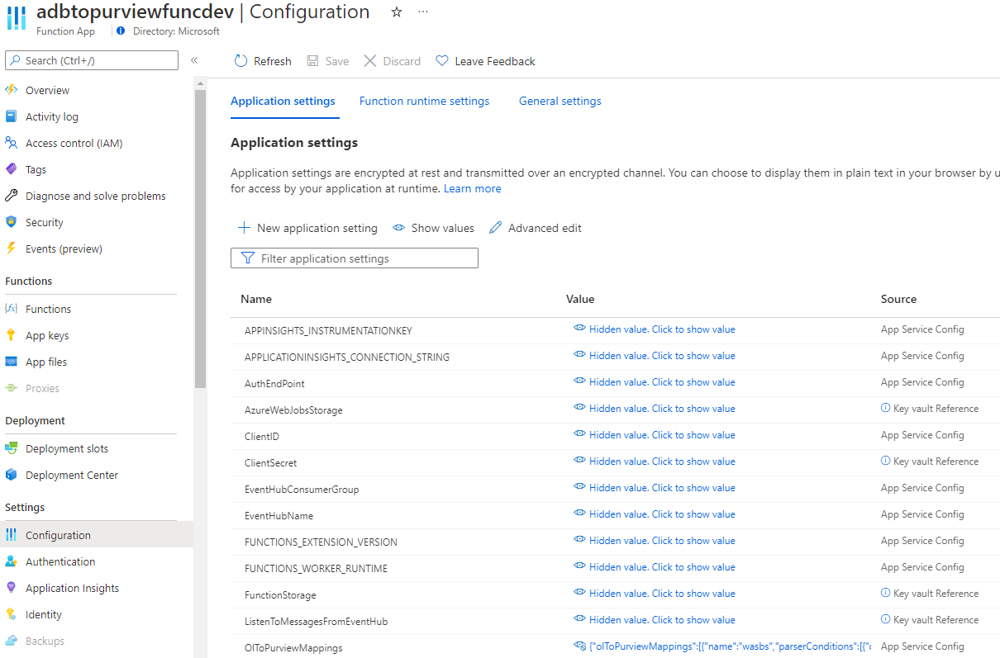
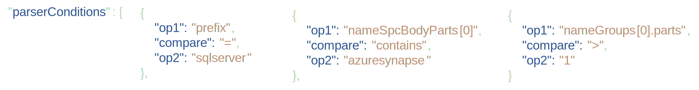
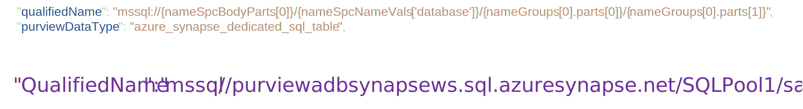

# Extending Source Support

## Linking lineage and qualified names

To build a lineage graph in Purview based on Spark data, we take the identifiers we get from OpenLineage of the various inputs (SQL tables, blob folders, etc.), and the identifier of the output, and map these to the corresponding entities in Microsoft Purview. In order to ensure this mapping is unique, we also supply a Purview type for these mappings.  
For example, if we get the following source identifier from OpenLineage

```infra
sqlserver://purviewadbsynapsews.sql.azuresynapse.net:1433;database=SQLPool1/sales.region
```

we need to create the qualified name that corresponds to the scanned reference entity for this table in Purview. To uniquely identify the table, we also need its Purview type

```infra
"qualifiedName": "mssql://{nameSpcBodyParts[0]}/{nameSpcNameVals['database']}/{nameGroups[0].parts[0]}/{nameGroups[0].parts[1]}",
"purviewDataType": "azure_synapse_dedicated_sql_table",
```

One of the main functions of the parser code is performing these transformations.

To make it easier for users to add support for sources we do not support and have not yet tested, we enabled the creation of these transformations through a Function configuration item called OlToPurviewMappings.



### Matching input to a specific source with criteria

The parser uses this setting to determine what criteria it needs to check to see what particular source type the input maps to, as well as the order in which to check this criteria. Once a match is made, further configuration defines the Purview data type associated with that particular source as well as the Qualified Name pattern to use to derive the sources Qualified Name identifier. Here is an example of the configuration for an Azure SQL source.

```json
{
    "name": "azureSQL",
    "parserConditions": [
        {
            "op1": "prefix",
            "compare": "=",
            "op2": "sqlserver"
        }
    ],
    "qualifiedName": "mssql://{nameSpcBodyParts[0]nameSpcNameVals['databaseName']}/dbo/{nameGroups[0]}",
    "purviewDataType": "azure_sql_table",
    "purviewPrefix": "mssql"
},
```

The collection of these configurations is processed from the top down, so the order of the items in the collection is important.  For example, if the entry for Azure SQL source occurred before the above entry for non-dbo Azure source, the non-dbo version would never be used, they would always be mapped to the less specific Azure SQL with default schema.

### Generating a Purview qualified name and data type

Once matched on a specific source configuration through criteria, that configuration will contain the associated data type as well as qualified name pattern to map back to Purview entities. Looking at the configuration, you can see that the criteria conditions and qualified name pattern contain tokens like {nameSpcBodyParts[0]} or {prefix}. These tokens represent parts of the OpenLineage input strings to enable the criteria matching and qualified name formation.

Continuing with the Azure SQL custom schema example above, the OpenLineage message stores the source data in two fields, 'name' and 'nameSpace'. The example below shows how this data is broken into tokens and how these are referenced in the configuration.


These tokens are fed into the defined parser conditions for all sources and matches to the conditions for this Azure SQL custom schema source



Once the match is made, the rest of the Azure SQL custom schema configuration provides the qualified name pattern and Purview type.



### Validating configurations

The configuration format can be complex, so a command line verification tool ([QualifiedNameConfigTester](./function-app/adb-to-purview/tests/tools/QualifiedNameConfigTester)) is provided for easy testing of new source configurations. You can build the utility by opening a terminal in the app directory and running:

```bash
dotnet build
```

Modify the [config.json](./tests/tools/QualifiedNameConfigTester/config.json) file to include your new source configuration, and then run the utility from the bin directory specifying the build file path.  For example:

```bash
.\bin\Debug\net6.0\QualifiedNameConfigTester.exe
```

The utility will prompt you for nameSpace and name OpenLineage values, and then show the resulting conversion and Purview type.

The utility uses the same code as the function application for evaluating qualified names, so you can be confident that the output generated from the configuration tool will match the configuration results in the function.
